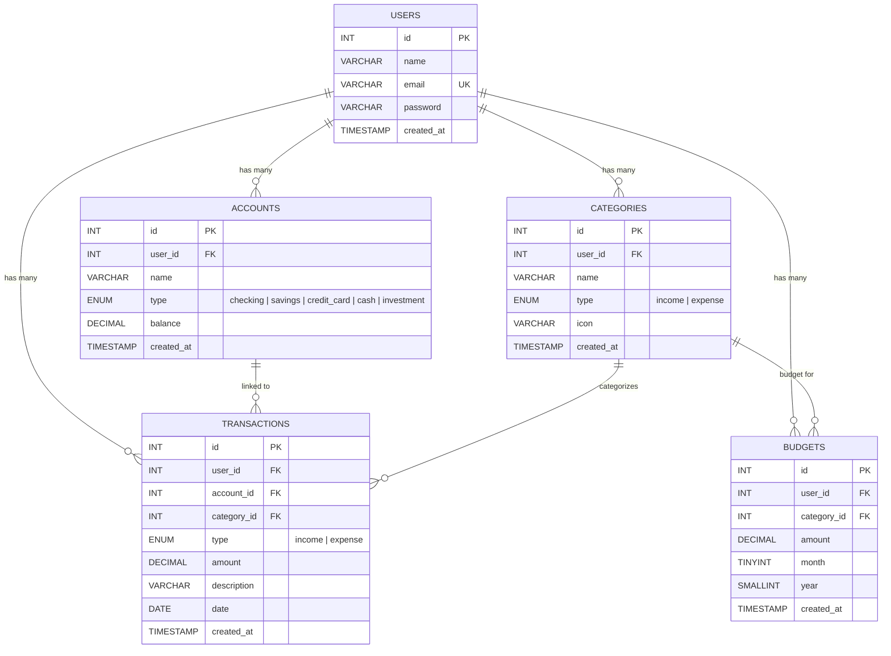
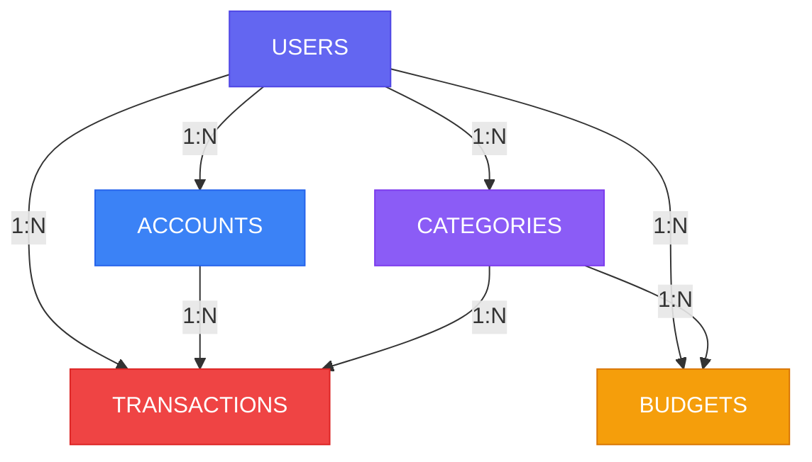

# FinTrack — Personal Finance Tracker

A full-stack personal finance management app built with **React**, **Node.js**, **Express**, and **MySQL**.

> Built to demonstrate relational database concepts: foreign keys, JOINs, aggregations, transactions, and normalization.

---

## 🖥️ Tech Stack

| Layer      | Technology                 |
|------------|---------------------------|
| Frontend   | React 19 + Vite            |
| Backend    | Node.js + Express          |
| Database   | MySQL (relational)         |
| Auth       | JWT + bcrypt               |
| Charts     | Recharts                   |
| HTTP       | Axios                      |

---

## 📊 Database Schema (5 normalized tables)

### Entity-Relationship Diagram



### Relationships Overview



### Key SQL Concepts Used
- **Foreign Keys** with `ON DELETE CASCADE`
- **JOINs** (INNER + LEFT) across 3 tables
- **GROUP BY** + **SUM** aggregations
- **MySQL Transactions** (`BEGIN` / `COMMIT` / `ROLLBACK`)
- **Sub-queries** (budget vs actual spending)
- **Indexes** for query optimization
- **ENUM** types, **UNIQUE** constraints
- **DATE functions** (`MONTH()`, `YEAR()`, `DATE_SUB()`)

---

## 📁 Project Structure

```
projectforjpmc/
├── server/                 # Backend API
│   ├── server.js           # Express entry point
│   ├── config/db.js        # MySQL connection pool
│   ├── middleware/auth.js   # JWT auth middleware
│   ├── routes/
│   │   ├── auth.js          # Register, Login, /me
│   │   ├── accounts.js      # CRUD
│   │   ├── categories.js    # CRUD
│   │   ├── transactions.js  # CRUD + MySQL transactions
│   │   ├── budgets.js       # Budget vs spending (JOINs)
│   │   └── dashboard.js     # Analytics (6 aggregate queries)
│   └── db/
│       ├── init.sql         # Schema definition
│       ├── runInit.js       # Run schema
│       └── seed.js          # Demo data
│
├── client/                 # Frontend
│   └── src/
│       ├── App.jsx          # Routing
│       ├── index.css        # Full design system
│       ├── context/AuthContext.jsx
│       ├── services/api.js  # Axios + interceptors
│       ├── components/      # Navbar, StatCard, ProtectedRoute
│       └── pages/           # Dashboard, Transactions, Accounts, Budgets, Categories
│
└── README.md
```

---

## 🚀 Setup Instructions

### Prerequisites
- **Node.js** (v18+)
- **MySQL** (v8+) running locally

### 1. Database Setup
```bash
# Update server/.env with your MySQL password
cd server
npm install
npm run db:init     # Creates database + tables
node db/seed.js     # Inserts demo data
```

### 2. Start Backend
```bash
cd server
npm run dev         # Runs on http://localhost:5000
```

### 3. Start Frontend
```bash
cd client
npm install         # Already done if you followed setup
npm run dev         # Runs on http://localhost:5173
```

### 4. Login
- **Email:** `demo@example.com`
- **Password:** `password123`

---

## ✨ Features

- **Dashboard** — Total balance, income/expense charts, spending breakdown pie chart
- **Transactions** — Add, filter (by type/account/category), delete with auto balance update
- **Accounts** — Manage bank accounts, wallets, credit cards with net worth
- **Budgets** — Set monthly budgets per category with progress bars
- **Categories** — Custom income/expense categories with emoji icons
- **Auth** — JWT-based registration and login

---

## 📝 Key Learning Points for DBMS

1. **`server/db/init.sql`** — Study the schema: 5 tables, foreign keys, indexes, constraints
2. **`server/routes/transactions.js`** — MySQL transactions with `BEGIN`/`COMMIT`/`ROLLBACK`
3. **`server/routes/dashboard.js`** — Complex aggregation queries with JOINs and GROUP BY
4. **`server/routes/budgets.js`** — LEFT JOIN with sub-query to compare budget vs actual spending
5. **`server/config/db.js`** — Connection pooling pattern

---

## License

MIT
