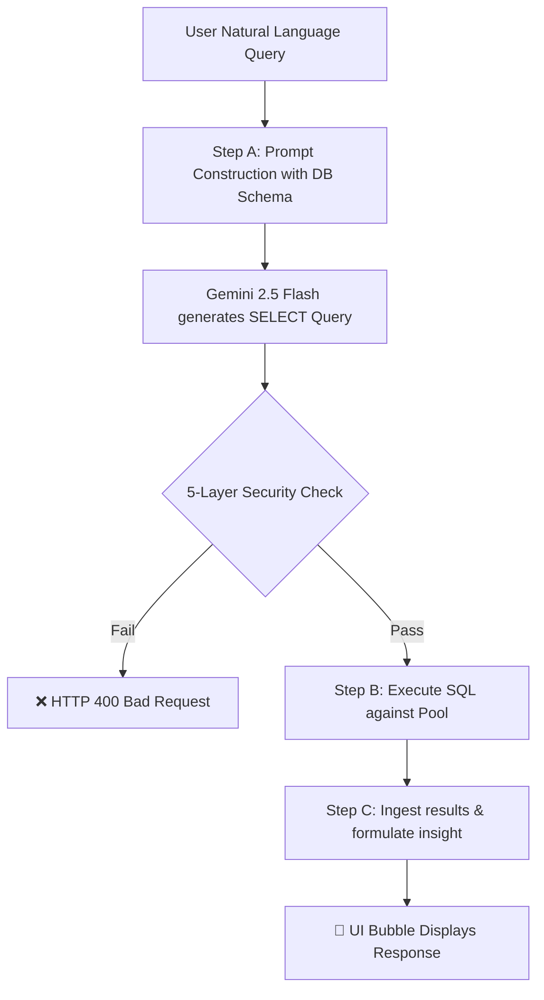
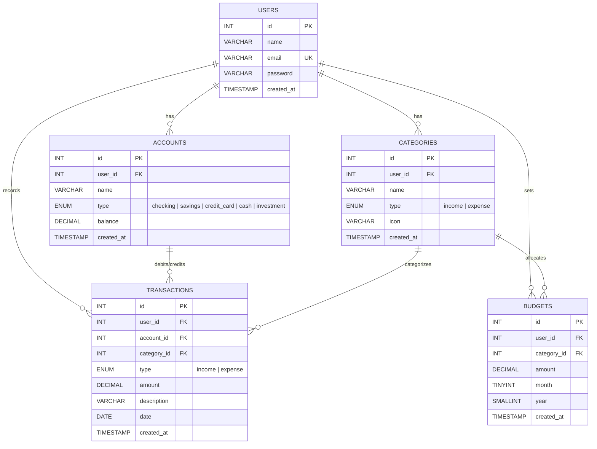

# 📊 FinTrack — Personal Finance Tracker with AI Insights


A full-stack, mobile-responsive personal finance manager. By combining a 3NF normalized relational database structure, safe atomic transactions, and a multi-stage **Text-to-SQL AI Assistant** powered by Google Gemini, the application allows users to manage their funds while querying their data in natural language.

---

## 🌐 Live Deployment

| Component | Status | URL |
|-----------|--------|-----|
| **Frontend (App)** | ⏱️ Pending | **[Launch Application (Link Placeholder)]()** |
| **Backend (API)** | ⏱️ Pending | [Check Health Status (Link Placeholder)]() |

---

## 🛡️ Text-to-SQL AI Assistant Pipeline

FinTrack features a custom natural language querying interface. Rather than relying on static dashboard queries, students and interviewers can query financial histories using standard conversation.

### The 3-Step LLM Pipeline



### 🔒 5-Layer Security Enforcement

To prevent SQL Injection, data exfiltration, or table drop attacks, the server executes five sequential validation steps on the generated query string prior to execution:

1. **Verify `SELECT` Only**: Ensures the query starts with a strict `SELECT` keyword.
2. **DML/DDL Blocklist**: Uses regex to block standard writing, updating, or destructive keywords:
   ```regex
   /\b(INSERT|UPDATE|DELETE|DROP|TRUNCATE|ALTER|CREATE|REPLACE|GRANT|REVOKE|EXEC|EXECUTE|CALL)\b/i
   ```
3. **No Direct User Table Access**: Blocks `FROM users` references to prevent exposed bcrypt password hashes or email lists from escaping.
4. **No UNION Exfiltration**: Blocks `UNION` statements, `INTO OUTFILE`, and `LOAD_FILE` to prevent cross-table data dump attacks.
5. **Strict Scope Validation**: Validates the presence of `user_id` filters to prevent query leakage across different users:
   ```regex
   /user_id\s*=\s*\d+/i
   ```

---

## 📊 Relational Database Design & Normalization

The core database architecture is built on a **3rd Normal Form (3NF)** relational layout. This guarantees data integrity, eliminates redundancy, and scales predictably.

### Database Entity-Relationship Diagram



### Normalization Breakdown

- **First Normal Form (1NF)**: All columns contain atomic values. Repeated values, such as tracking multiple transactions in a single array cell, are avoided by separating them into single row entities.
- **Second Normal Form (2NF)**: All tables have a designated Primary Key. Non-key columns depend entirely on the primary key (e.g. `balance` belongs strictly to `accounts.id` and not the user overall).
- **Third Normal Form (3NF)**: Eliminates transitive dependencies. For example, the `transactions` table contains only foreign keys pointing to `accounts` and `categories`. It does not store category icons or names directly. This prevents update anomalies where changing a category name would require rewriting every past transaction.

---

## 🖥️ Tech Stack

- **Frontend**: React 19, Vite 7, Tailwind CSS v4, Recharts, Axios
- **Backend**: Node.js, Express, `@google/generative-ai`
- **Database**: MySQL, `mysql2/promise` connection pooling
- **Authentication**: Stateless JSON Web Tokens (JWT), bcrypt password hashing

---

## 📝 Key DBMS Learning Concepts Demonstrated

1. **ACID Transactions**: Storing transactions executes atomic operations in `server/routes/transactions.js`. Balance increments and transaction records either succeed together or roll back entirely:
   ```sql
   START TRANSACTION;
   INSERT INTO transactions ...;
   UPDATE accounts SET balance = balance - amount WHERE id = ...;
   COMMIT;
   ```
2. **Aggregations & Complex JOINs**: Dashboard routes perform multi-table left joins and aggregations to sum monthly logs, group spending by categories, and fetch 6-month trends.
3. **Database Performance Indexing**: High-traffic lookups index on common search parameters (e.g. compound index on `(user_id, date)` and `(user_id, category_id)`).

---

## 📁 Repository Structure

```
expense_tracer/
├── server/                         # Express REST API
│   ├── server.js                   # Application Boot
│   ├── config/db.js                # connection pool configuration
│   ├── middleware/auth.js          # JWT Route Protection
│   ├── routes/
│   │   ├── auth.js                 # Registration / Authentication
│   │   ├── accounts.js             # Account CRUD
│   │   ├── categories.js           # Category Settings
│   │   ├── transactions.js         # Transaction Entries
│   │   ├── budgets.js              # Limits & Threshold Checks
│   │   ├── dashboard.js            # Analytical Visual Queries
│   │   └── insights.js             # Text-to-SQL Gemini Endpoint
│   └── db/
│       ├── init.sql                # Table definitions & DDL scripts
│       ├── runInit.js              # Database initialization script
│       └── seed.js                 # Sample database records
│
└── client/                         # React SPA (Vite)
    ├── src/
    │   ├── components/
    │   │   ├── Navbar.jsx          # Mobile Hamburger / Sidebar
    │   │   └── AIChat.jsx          # Sliding Chat Window & Suggestion Tags
    │   ├── context/
    │   │   └── AuthContext.jsx     # User Context Provider
    │   ├── pages/
    │   │   ├── Dashboard.jsx       # Analytics & Visual charts
    │   │   ├── Transactions.jsx    # Ledger overview
    │   │   ├── Accounts.jsx        # Managed checking/savings wallets
    │   │   └── Budgets.jsx         # Category progress limits
    │   └── services/
    │       └── api.js              # Axios instance configuration
```

---

## ⚙️ Environment Configuration

### Backend Setup (`server/.env`)
```env
PORT=5000
DB_HOST=localhost
DB_USER=root
DB_PASSWORD=your_mysql_password
DB_NAME=finance_tracker
JWT_SECRET=your_cryptographically_secure_jwt_secret
GEMINI_API_KEY=your_gemini_api_key_from_google_ai_studio
```

### Frontend Setup (`client/.env.local`)
```env
VITE_API_URL=http://localhost:5000/api
```

---

## 🚀 Setup Instructions

### 1. Database Initialization
Ensure your local MySQL service is running, then execute:
```bash
cd server
npm install
npm run db:init     # Provisions tables and relations
node db/seed.js     # Seeds initial demo data
```

### 2. Start Servers
Run the backend API:
```bash
cd server
npm run dev
```

In a new terminal window, start the frontend server:
```bash
cd client
npm install
npm run dev
```
Open **http://localhost:5173** to view the application.

---

## 📜 License
MIT License.
